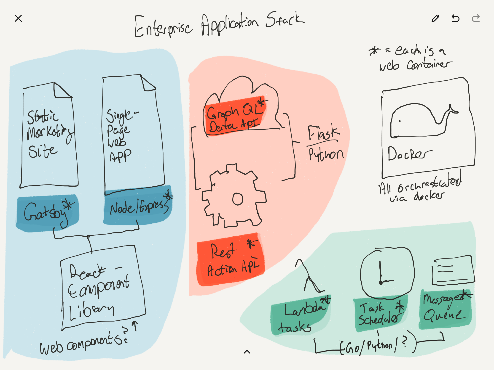
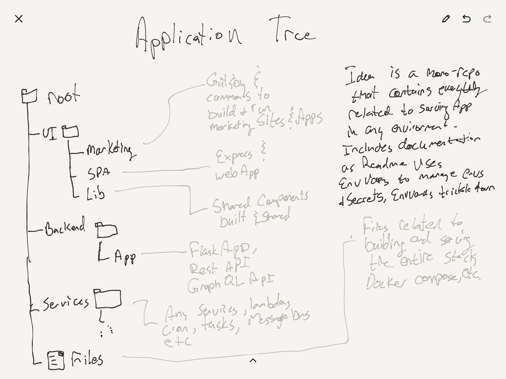

# Enterprise Web Application Stack




Exploring a complete setup.


# Setup

## Node
There's a `.nvmrc` file in the root, so use it with `nvm use` to ensure that
you are using the right version of node.


# Running

to Run in production:
- `cd docker && docker-compose up --build`.
- `docker-compose start`
- `docker-compose logs -f`

to stop:
- `docker-compose down`

# Debugging

To attach to any running container, try
`docker exec -it {id} /bin/bash`
where {id} is replaced with your running container

## Tree

```
.
├── README.md  (this file)
├── backend (all the backend services)
│   └── app (will probably actually contain both the graphQL lib and REST API)
├── docker (The main app docker files)
│   └── docker-compose.yaml
├── services (All the services we use will go here (bus, etc.))
└── ui
    ├── lib (shared resources for both apps)
    ├── marketing (static marketing site)
    └── spa (single page web application, UI for the app)
```

# TODO
- [ ] Set up Dockerfiles
  - [x] for marketing
  - [x] for spa
  - [ ] for database
  - [ ] for api
- [ ] Connect the Web SPA to the backend service
- [ ] Set up a development docker-compose script that
  - [ ] supports hot reloading for the ui commands
  - [ ] restarts the python server when changes happen to the files
- [ ] Basic User / AUTH support
- [ ] Add user groups / permissions, ACLs
- [ ] Set up secrets, use ENV or something so developers can avoid secrets in repo and store their own
- [ ] Start work on deployment to AWS.


# Issues

# Room For Improvement

- Take a look at security, user for docker images, etc.
